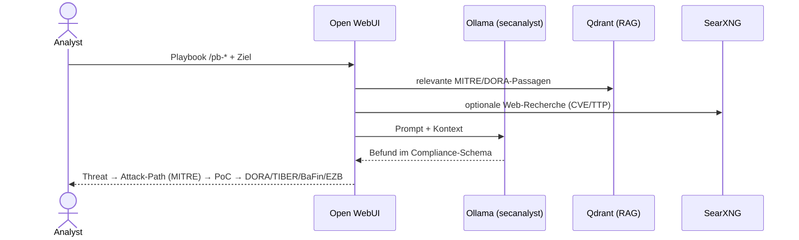
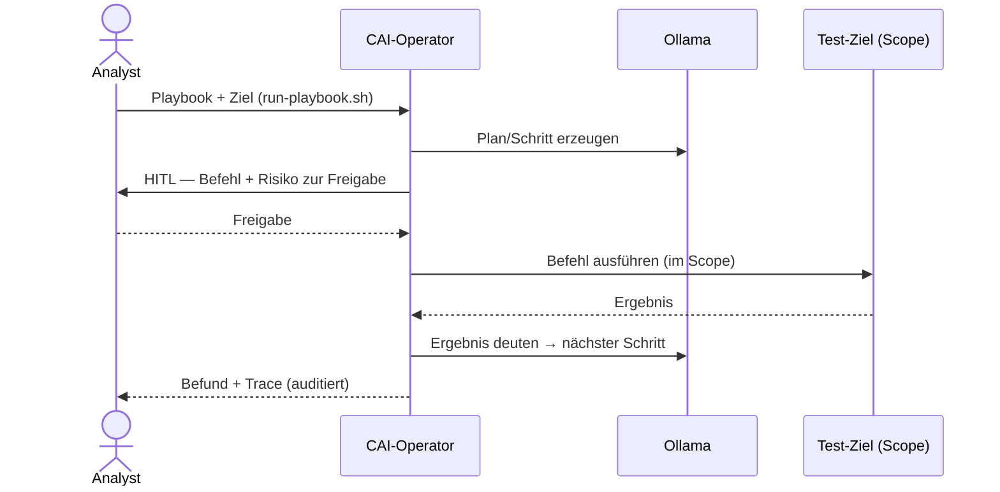
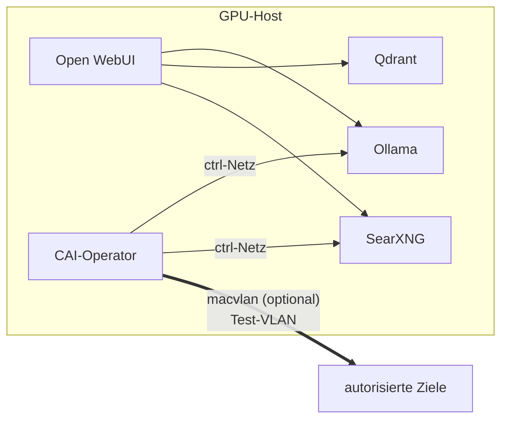

# Architektur

## Komponenten
| Dienst | Rolle | Port |
|---|---|---|
| Ollama (Host) | LLM-Inferenz (Multi-GPU) | 11434 |
| Open WebUI | Frontend: Chat, RAG, Playbook-Sektion | 8080 |
| Qdrant | Vektor-DB für RAG-Wissensbasis | 6333 |
| SearXNG | self-hosted Web-Recherche | 8888 |
| CAI-Operator | agentische Ausführung (Kali + CAI) | — |

## Datenfluss (Befund-Erzeugung)

## Agentische Ausführung (Operator)

## Netz-Sicht (mit optionaler L2-Isolation)

> Screenshots der laufenden Oberfläche: siehe [docs/img](img/). Platzhalter, bis
> sanitierte Screenshots (ohne interne IPs/Hostnamen) ergänzt werden.
