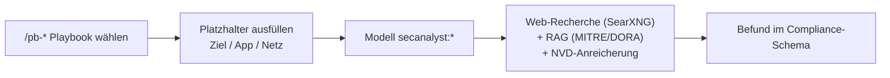

# Open-WebUI-Sektion & Playbooks

Dedizierte Arbeitsumgebung: Modelle, Playbook-Prompts und Web-Recherche unter
`http://<KI02_HOST>:8080`.

## Modelle
- `secanalyst:dora` — Reporting im Compliance-Schema.
- `secanalyst:operator` — Planungs-/Operator-Reasoning.
- `secanalyst:uncensored` — abliteriertes 32B.

## Playbooks (nur Ziel/Netz/App eintragen)
| Slash-Command | Zweck | Platzhalter |
|---|---|---|
| `/pb-recon` | Recon & Asset-Profiling | `{{TARGET}}` |
| `/pb-webapp` | Web-App-Assessment (OWASP) | `{{APP_URL}}` |
| `/pb-extsurface` | Externe Angriffsfläche / OSINT | `{{DOMAIN}}` |
| `/pb-intnet` | Internes Netz / Lateral | `{{SUBNET}}` |
| `/pb-attackpath` | Attack-Path + PoC | `{{TARGET}}` |
| `/pb-tlpt` | TIBER/DORA Threat-Szenario | `{{TARGET}}` |

## Provisionierung
```bash
export WEBUI_TOKEN='...'                  # Open WebUI: Settings → Account → API Keys
export WEBUI_URL='http://<KI02_HOST>:8080'
bash openwebui/provision.sh               # legt alle /pb-* Playbooks an
```

## Ablauf



## Web-Recherche
Self-hosted SearXNG; im Chat die Web-Suche aktivieren. Keine Cloud-Suchschnittstelle,
nur SearXNG holt Ergebnisse von öffentlichen Suchmaschinen.

> Screenshots: [docs/img](img/) (sanitiert, ohne interne IPs/Hostnamen).
