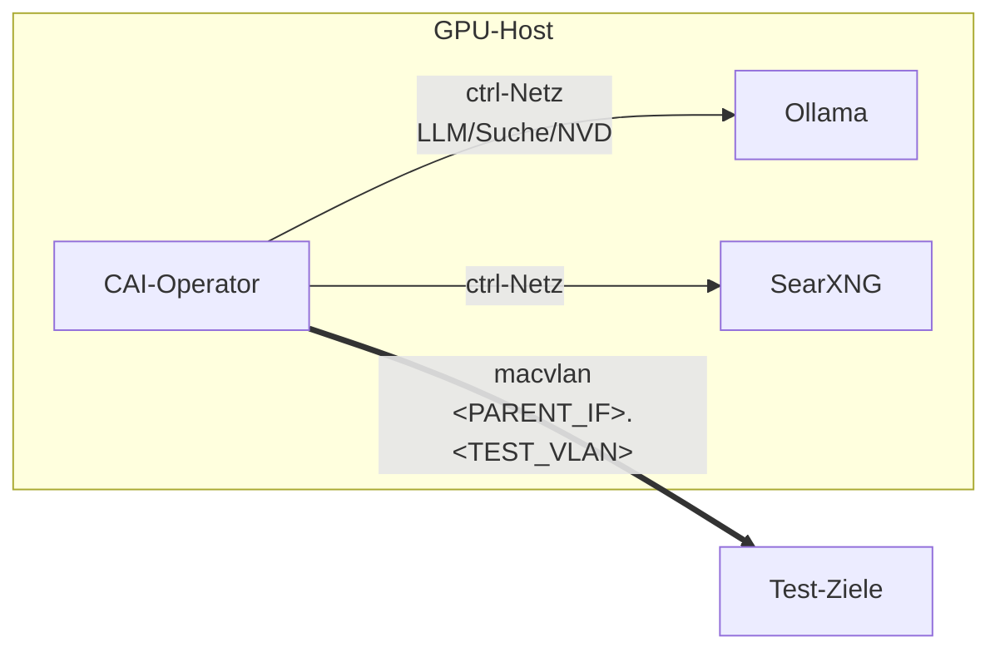

# CAI-Operator & Netz-Isolation

Der CAI-Operator (Kali + CAI-Framework) führt autorisierte Aktionen **agentisch** aus:
Recon, Enumeration, Verprobung, Tool-Nachladen, Web-Recherche — mit
**Human-in-the-Loop** (Freigabe vor jedem Befehl) und vollständigem Tracing.

## Governance-Kontrollen
- **Scope/RoE** (`cai/scope.txt`): nur gelistete Ziele; der eigene Host ist out of scope.
- **HITL an** (`CAI_HITL=true`): Agent fragt vor jeder Ausführung.
- **Runaway-Schutz** (`CAI_MAX_TURNS`).
- **Tracing/Audit** (`CAI_TRACING=true`): Nachweis für BaFin/DORA.
- **Verbote**: DoS, PII-Exfiltration, unkoordinierte Persistenz.

## Playbooks (Operator)
```bash
docker compose exec cai-operator /operator/run-playbook.sh recon      <host>
docker compose exec cai-operator /operator/run-playbook.sh webapp     <url>
docker compose exec cai-operator /operator/run-playbook.sh extsurface <domain>
docker compose exec cai-operator /operator/run-playbook.sh intnet     <subnet>
docker compose exec cai-operator /operator/run-playbook.sh attackpath <host>
docker compose exec cai-operator /operator/run-playbook.sh tlpt       <system>
```

## Netz-Isolation
**Default:** Bridge/Host-Routing — schnell, aber Traffic erscheint mit Host-IP.
**Empfohlen:** macvlan auf dediziertem Test-VLAN (eigene IP/MAC, kein Host-SNAT).



Aktivierung (Werte an eigene NIC/VLAN anpassen):
```bash
bash cai/network-setup.sh                 # legt VLAN-Subinterface + macvlan-Docker-Netz an
docker compose -f docker-compose.yml -f docker-compose.netiso.yml up -d
```

> macvlan-Container sind per Default nicht vom Host direkt erreichbar (by design);
> Steuerung/LLM/NVD laufen daher über das zusätzliche `ctrl`-Netz.
