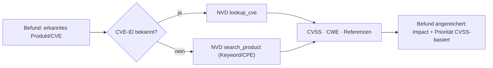

# NVD-Anreicherung (NIST National Vulnerability Database)

Befunde werden automatisch mit offiziellen NVD-Daten angereichert: **CVSS** (Score +
Vektor), **CWE** und **Referenzen**. Quelle: NVD CVE-API 2.0.

## Zwei Integrationswege
1. **Open-WebUI-Tool** (`nvd_tool.py`) — das Modell ruft NVD während der Bewertung
   selbst auf (Function-Calling). Methoden:
   - `lookup_cve(cve_id)` — konkrete CVE (z. B. `CVE-2021-44228`).
   - `search_product(keyword)` — Produkt/Version, wenn keine CVE-ID bekannt ist.
2. **CLI** (`nvd_lookup.py`) — vom CAI-Operator genutzt:
   ```bash
   python3 nvd/nvd_lookup.py --cve CVE-2021-44228
   python3 nvd/nvd_lookup.py --keyword "Apache Log4j 2.14.1" --limit 5
   ```

## Datenfluss



## Einrichtung
- Open WebUI: Workspace → Tools → **+** → Inhalt von `nvd_tool.py` einfügen → speichern →
  dem Modell `secanalyst:*` zuweisen.
- API-Key (optional, höheres Rate-Limit): `NVD_API_KEY` in `.env` bzw. in den Tool-Valves.
  Anfrage: <https://nvd.nist.gov/developers/request-an-api-key>.

## Hinweise
- Rate-Limit ohne Key: 5 Anfragen/30 s; mit Key: 50/30 s (Tool behandelt 403/429 mit Backoff).
- NVD liefert die höchste verfügbare CVSS-Version (v3.1 > v3.0 > v2).
- NVD-Daten sind die **faktenbasierte** Gegenprobe zu modellseitig genannten CVEs —
  Halluzinationen werden so erkannt.
