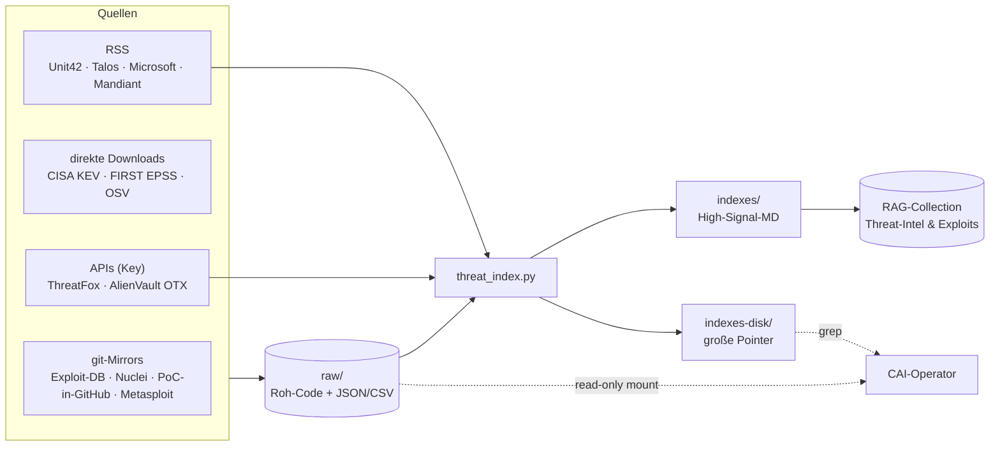

# Threat-Intel-/Exploit-Feeds & täglicher Refresh

Lokaler, **täglich aktualisierter** Korpus aus Exploits, PoCs und Threat-Intelligence.
Ziel: Attack-Path-Konstruktion und PoC-Auswahl gegen eine **on-premise** Faktenbasis statt
gegen flüchtige Web-Suchen — referenzierbar (mit Quell-Pfad) und ohne Cloud-Abhängigkeit.

## Hybrid-Architektur

Drei Schichten, je nach Signal-Dichte und Größe unterschiedlich verarbeitet:

| Schicht | Ort | Zweck |
|---|---|---|
| **Roh-Dumps** | `raw/` (Platte, read-only) | echter Exploit-/PoC-Code, grep-/zitierbar, vom Operator gemountet |
| **Embedded-Indizes** | `indexes/` → RAG-Collection | kompakte High-Signal-Markdowns, volltext im Vektor-RAG |
| **Disk-Indizes** | `indexes-disk/` (nur Platte) | große Pointer-Listen (zu groß fürs Embedding), per grep referenzierbar |

## Quellen

**Key-frei (git / Download):**
- Exploit-DB (inkl. Google-Hacking-DB / Dorks)
- Nuclei-Templates (CVE-YAMLs)
- PoC-in-GitHub (kuratierte PoC-Repos pro CVE)
- Metasploit-Framework (Modul-Code sparse + Modul-Metadaten)
- CISA KEV (aktiv ausgenutzte CVEs), FIRST EPSS (Exploit-Wahrscheinlichkeit), OSV (Advisories)

**Mit API-Key:**
- abuse.ch ThreatFox (aktuelle IOCs) — Auth-Key von `auth.abuse.ch`
- AlienVault OTX (abonnierte Pulses)

**RSS (Reports):** Unit42, Cisco Talos, Microsoft Security, Mandiant/Google TI.

> Schlüssel werden ausschließlich in einer lokalen `.secrets.env` (chmod 600) gehalten und sind
> **nicht** Teil dieses Repos. Siehe [07 — Security & Sanitization](07-security-sanitization.md).

## Embedded-Indizes (im RAG)
`cisa-kev` · `epss-high` · `metasploit-modules` · `otx-pulses` · `threat-intel-rss` · `threatfox-recent`

Hochsignalige, kompakte Markdowns. Große Roh-Korpora (Exploit-DB-Volltext, alle Nuclei-Templates,
PoC-in-GitHub) werden **bewusst nicht** eingebettet, sondern als Pointer-Index auf Platte gehalten
und vom Operator per `grep` erschlossen — das hält die Vektor-DB schlank und treffsicher.

## Täglicher Refresh (Cron 06:00)
`refresh.sh` ist idempotent und best-effort je Schritt:

1. **Roh-Mirrors** aktualisieren (`git pull` + Downloads).
2. **Indizes** neu generieren (`threat_index.py`).
3. **RAG-Collection** zurücksetzen und frische Indizes einbetten.
4. **Dokumenten-RAG** inkrementell nachziehen (privates Korpus, nur lokal).

## Betriebs-Fallstricke (gelöst)

- **Metasploit-Metadaten:** `git sparse-checkout` im Cone-Mode kann **keine Einzeldateien**
  auschecken — die ~10 MB Modul-Metadaten (`db/modules_metadata_base.json`) daher **direkt per
  Download** holen, nicht über sparse `db/...`.
- **OTX-Timeouts:** der `…/pulses/subscribed`-Endpoint läuft bei vielen Abos serverseitig in
  Gateway-Timeouts (504). Stattdessen `…/pulses/activity` paginiert mit Retry verwenden.
- **abuse.ch Auth-Key:** ein frisch erzeugter Key liefert zunächst `unknown_auth_key` —
  er braucht einige Minuten **Propagation** über die API-Backends, danach `query_status: ok`.
  Die Index-Funktion degradiert bei ungültigem/nicht-propagiertem Key sauber (kein Abbruch).
- **Synchrones Embedding:** das Anhängen großer Indizes (z. B. Metasploit, tausende Sektionen)
  embeddet synchron und überschreitet kurze HTTP-Client-Timeouts — Timeout **größenabhängig**
  wählen, sonst wird ein serverseitig erfolgreicher Vorgang fälschlich als Fehler gezählt.
- **Speicher:** Volltext-Embedding großer OCR-/Korpus-Dateien auf CPU ist speicherintensiv;
  auf RAM-knappen Hosts Text vorab extrahieren und nur Text einbetten (kein In-Memory-PDF-Parse).
